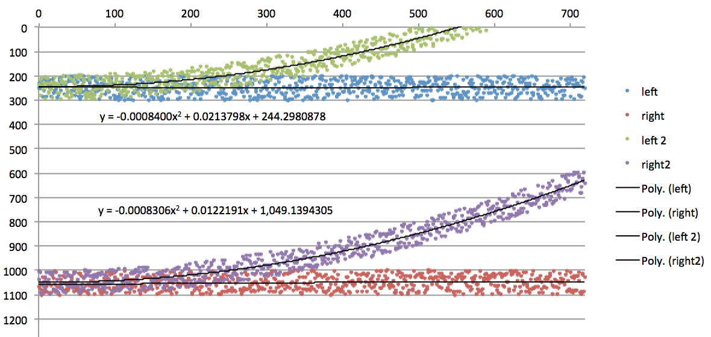
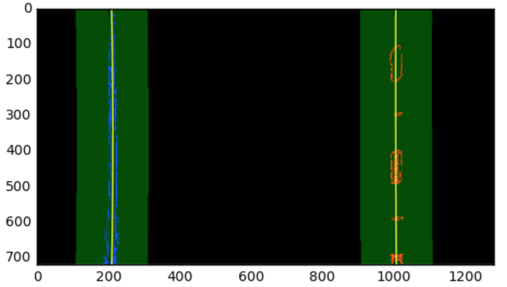

# Udacity-P4-AdvancedLaneLines
Computer Vision for Road Lane Finding using Vehicle Front Camera

By: Chris Gundling

---

The goals of this project were the following:
- Compute the camera calibration matrix and distortion coefficients given a set of chessboard images.
- Apply a distortion correction to raw images.
- Use color transforms, gradients, etc., to create a thresholded binary image.
- Apply a perspective transform to rectify binary image ("birds-eye view").
- Detect lane pixels and fit to find the lane boundary.
- Determine the curvature of the lane and vehicle position with respect to center.
- Warp the detected lane boundaries back onto the original image.
- Output visual display of the lane boundaries and numerical estimation of lane curvature and vehicle position.

### Code Summary
I used two different python notebooks for this project, the first (`P4-AdvancedLanes-Tuning.ipynb`) for developing an initial solution using single images at a time and tuning the various parameters. The second (`P4_AdvancedLaned-Video.pynb`) was for testing on the project video. In the video notebook I have simplified many of the steps in order to speed up the image processing pipeline. The following sections will refer mostly (`P4-AdvancedLanes-Tuning.ipynb`) and the video section will refer to (`P4_AdvancedLanes-Video.pynb`).

### Step 1: Camera Calibration

*Rubric: Briefly state how you computed the camera matrix and distortion coefficients. Provide an example of a distortion corrected calibration image.*

I split up the camera calibration into three steps, which are shown in the first 3 code cells of `P4-AdvancedLanes-Tuning.ipynb`:
- 1a. Find the corners, undistort and warp
- 1b. Example of Image Calibration
- 1c. Example of Image Warping

I start by preparing "object points", which will be the (`x, y, z`) coordinates of the chessboard corners in the world. I assume the chessboard is fixed on the (`x, y`) plane at z=0, such that the object points are the same for each calibration image. `objp` is just a replicated array of coordinates, and `objpoints` is appended with a copy of it every time I successfully detect all chessboard corners in a test image. This happens for 17 of the calibration images when I use 9X6 for the number of corners. `imgpoints` are appended with the (`x, y`) pixel position of each of the corners in the image plane with each successful chessboard detection.

The output `objpoints` and `imgpoints` are then used to compute the camera calibration and distortion coefficients using the `cv2.calibrateCamera()` function. Distortion correction to the test image is then completed using the `cv2.undistort()` function. The following images show the before and after:


### Step 2: Pipeline (Single Images)

##### 1. Distortion Correction

*Rubric: Has the distortion correction been correctly applied to each image?*

The first step in my image processing pipeline was to undistort the image using the camera calibration information. The code for this step is at `Step 2: Apply Calibration to Raw Images` and produces the following result for one of the test images:


#### 2. Color Transforms, Gradients and Other Methods

*Rubric: Describe how (and identify where in your code) you used color transforms, gradients or other methods to create a thresholded binary image.  Provide an example of a binary image result.*

I used several different techniques to create my final binary_warped image. I actually found that applying the perspective transform first gave better results and made it easier to see what the polynomial fits were trying to fit to. This is described in following sections, but I wanted to quickly mention it since all the transformed images have already been warped.

In `Steps 3b-3e` in `P4-AdvancedLanes-Tuning.ipynb` I first used color space transforms on my images, both to grayscale and to HLS color space. I found that using a combination of both these techniques helped to see both white and yellow lines. After applying the transform, the pixel values are thresholded by (gray threshold: `thresh_g = (180, 255)` and HLS threshold: `thresh_s = (160, 255)`). The threshold values were determined from extensive testing using all of the provided test images. Only the saturation channel of the HLS colorspace was used as this proved particulary useful in seeing the yellow lines.

Once the color space transform and thresholding is applied, I then used functions that applied Sobel Threshholding in the x and y orientations, gradient magnitude and directional gradient thresholding to further process the images. Each of these techniques is able to pick up different aspects of the line pixels in each image. The following shows the final inputs to each of these functions.

```
# Sobel X on HLS
gradx_s = abs_sobel_thresh(bird, orient='x', thresh_min=5, thresh_max=100, HLS=True) 

# Sobel Y on HLS
grady_s = abs_sobel_thresh(bird, orient='y', thresh_min=5, thresh_max=100, HLS=True) 

# Magnitude on HLS
mag_binary_s = mag_thresh(bird, sobel_kernel=9, mag_thresh=(50, 200), HLS=True) 

# Magnitude on Grayscale
mag_binary = mag_thresh(bird, sobel_kernel=9, mag_thresh=(50, 200),HLS=False) 

# Directional on HLS
dir_binary_s = dir_threshold(bird, sobel_kernel=15, thresh=(0.7, 1.3), HLS=True) 
```

Once the colorspace and gradient techniques were performed, I combined several of these techniques to create the final `binary_warped` image. Once again, this required significant tuning based on the test images and the final video. The final line of code to create the `binary_warped` image and an example of the binary warped image are shown below:

`binary_warped[((gradx_s == 1) & (grady_s == 1)) | (mag_binary_s == 1) | (dir_binary_s == 1) | (mag_binary == 1)] = 1`


#### 3. Perspective Transform

*Rubric: Describe how (and identify where in your code) you performed a perspective transform and provide an example of a transformed image.*

As previously mentioned, the perspective transform was performed directly after distortion correction. I found it much easier to tune the various color space and gradient transforms when viewing the binary image from the bird’s eye view. Unexpectedly the bird's eye view also created an excellent mask for only the area of interest in the image. This code has been implemented in section `3a. Birds-Eye Perspective Transform` in the `P4-AdvancedLanes-Tuning.ipynb` notebook and the function is called `birds_eye()`.

The birds_eye() function takes as inputs an image (`img`) and harcodes the source (`src`) and destination (`dst`) points. After considerable tuning, mostly experimenting with the transformed image's width and height, the source and destination points were finalized to be:

| Source        | Destination   | 
|:-------------:|:-------------:| 
| 580, 460      | 200, 100      | 
| 200, 720      | 200, 720      |
| 706, 460      | 1040, 100     |
| 1140, 720     | 1040, 720     |

I verified that my perspective transform was working as expected by visually inspecting the resulting image for parallel lines when using images with straight lane lines. The before and after results can be seen in the following picture:


#### 4. Lane Line Curve Fitting (Histograms and Sliding Windows)

*Rubric: Describe how (and identify where in your code) you identified lane-line pixels and fit their positions with a polynomial?*

After creating the `binary_warped` image, the next step was to apply a histogram to the image to determine the peak locations of pixels in the image. A function to determine the histogram is coded in section `Step 4a. Histogram of Output` in the notebook. Once the histogram was found, a sliding window technique was used to isolate the lane line pixels in the image. This code can be found in section `4b. Sliding Windows and Polynomial Fit` in the notebook. 

This was a critical step in the code for determining the proper left and right lane lines. The sliding windows (rectangles) start with their center at the X locations were the histogram peaks occur. The sliding windows are then extended 120 pixels in the +/- X directions (`margin = 120`) and look for a minimum of 60 pixels. If this condition is met, then the next sliding window will be cetered at the average X location of these pixels, otherwise they will continue to center around the histogram peaks. Once the lane pixel indices and X,Y locations are determined, a 2nd order polynomial fit was used to fit lines to these pixels for both the left and right lane lines using the numpy polyfit function.
```
left_fit = np.polyfit(lefty, leftx, 2)
right_fit = np.polyfit(righty, rightx, 2)
```

An example of the histogram and the sliding window fit is shown below.


Still within the `sliding_windows()` function, the next steps are where I spent the most time and achieved the biggest gains in results. I used several different techniques to check that the determined polynomial fits for each lane line were realistic. 

1. Limits to Polynomial Coefficients: I first created several made up (random) curves that were similar in curvature to what the lane lines would be. This allowed me to get a good grasp for the values that I should be expecting for the polynomial coefficients. A plot of this is shown below. Using this information I limited the values that the squared and linear terms could take. 



2. Confidence of left/right lanes: Based on the number of pixels found corresponding to each lane line I implemented a “confidence” metric. This metric interesting to watch during the video processing and was used in other pre-processing techniques. To determine the optimal number of pixels found for the left and right lanes, I compared the number of pixels found during the relatively easy straight lines images with images that had high curvature, shadows and other road markings.

3. Lane Width Check: The distance lane wifth should not change drastically, it should constantly be around 3.7 meters or 800 pixels in my implementation. I applied a check for this and if the lane lines were too far apart or too close together I would discard the information from the lane line with the least “confidence”. The discarded lane line was then given the pixels from the more confident lane line shifted by 800 pixels in the appropriate direction.

4. Averaging the Fits: I stored the fits from each images an applied an averaging (smoothing) over the most recent 20 images. Since the video is taken at 25 fps, this corresponds to smoothing of approximately 1 second of images. This helped to stablize the line fits and reduce the jitter that could be seen in the video.

5. Checking for Outliers: I implemented a technique that looked for outliers in the polynomial fit coefficients, but I did not end up using this function for the final video. The limits on the polynomial fit coefficients described above worked significantly better.

Finally in `Step 4c. Skip the sliding window now that we have lines` of the notebook, I implemented a function called `find_lines()` that used the curve fits from the previous timestep to determine the new lines. Once the sliding window techqiue is performed in the first frame, the base of the left/right lanes nearest to the vehicle should not change greatly from frame to frame. Thus, the previous step's curve fit along with a margin was used to determine the current timestep fits. An example of this technique is shown below with the search area around the polynomial curves highlighted in green:



#### 5 and 6. Visualizing the Lanes and Calculating Lane Information

*Rubric: Describe how (and identify where in your code) you calculated the radius of curvature of the lane and the position of the vehicle with respect to center.*

*Rubric: Provide an example image of your result plotted back down onto the road such that the lane area is identified clearly.*

The next step is coded in `Step 4d. Radius of curvature` of the notebook. A function called `rad_curve()` draws the lane lines on the image, determines the radius of curvature of the lines and determines the car’s position relative to the center of the lanes. The polynomial fits have the form:


From this equation, the radius of curvature can then be calculated at any point x of the function x=f(y) is given as follows:


The first and second derivatives of the second order polynomial used to fit the lane lines are:


So, the equation for radius of curvature becomes:


The radius of curvature was first calculated in "pixel space", but we actually need to repeat this calculation after converting our x and y values to "real world" space. This is done by scaling the x and y axis by their real word distances. The lane was assumed about 30 meters long and 3.7 meters wide.

The vehicle's position relative to center can then be found by considering the difference of the center of the image (camera/vehicle center) to the center of the lane (right lane + left lane / 2). This was also scaled to real world space.

I then created visualizations of the full lane and lane lines using the opencv `cv2.fillPoly()` function. All of the lane line information including radius of curvature, distance from center and lane prediction confidence were also added to the images. 

I then tested the full implementation of all these techniques on the 6 test images that were provided and the results can be seen below.


---

### Step 3: Pipeline (Video)

*Rubric:	Provide a link to your final video output.  Your pipeline should perform reasonably well on the entire project video (wobbly lines are ok but no catastrophic failures that would cause the car to drive off the road!).*

Once I had achieved reasonably results on these test images, then I simplified as much of the code as I could (`P4_AdvancedLanes-Video.pynb`) and ran the video through it. A key part of this process was using subclips from the video to further tune the solution using a command such as: `clip1 = VideoFileClip("project_video.mp4").subclip(35,45)`.

Here's a [link to my video result](./P4_finalvideo.mp4) and here is the youtube link.

---

### Discussion

*Rubric: Briefly discuss any problems / issues you faced in your implementation of this project.  Where will your pipeline likely fail?  What could you do to make it more robust?*

This project was an eye opening experience. Realizing how much tuning was required to the color space, gradient and polynomial techniques to reach a successful result was very surprising. While the resulting code worked well for the project video, I found that it did not perform particularly well on the challenge videos. For vehicle manufacturers to implement similar approaches that generalize well to all lane situations (or situations with no lane lines) seems like an incredibly difficult task using only these techniques. Working with machine/deep learning algorithms over the past few months, I have grown accustom to implementing "smart" models that learn on their own. The pipeline implemented here was not smart and feels highly "overfit" to the project video images. 

To overcome these difficiencies, I implemented a metric in this project that I think could be used for further improvements in performance. By using an optimization technique, the “confidence” metric for each of lane lines detection could be maximized. This would be done by having all of the tunable parameters as inputs to the optimizer and the confidence as the output. The model would then be tested over a range of thousands (or millions) of different images and the tunable parameters would be selected such as to maximize the total lane line prediction confidence for all of the images.  

Judging from the challenge videos, this lane line fiding implementation will fail when there is large road curvatures, significant shadows, or other road lines/cracks that have strong gradients. In addition to the optimization method mentioned above, another technique to make this more robust could be to determine the typical thickness of the lane lines and to filter out lines that don't have a minimum thickness. 

The final idea that could make these techniques more robust would be to combine the computer vision method implemented here with a CNN or other machine learning type model that can classify portions of the road that are lanes versus not. The implementation would be similar to the techniques used in project 5 to identify vehicles, except it would be for lane lines instead. The computer vision and machine learning approaches could be compared against one another to achieve a more robust solution.
